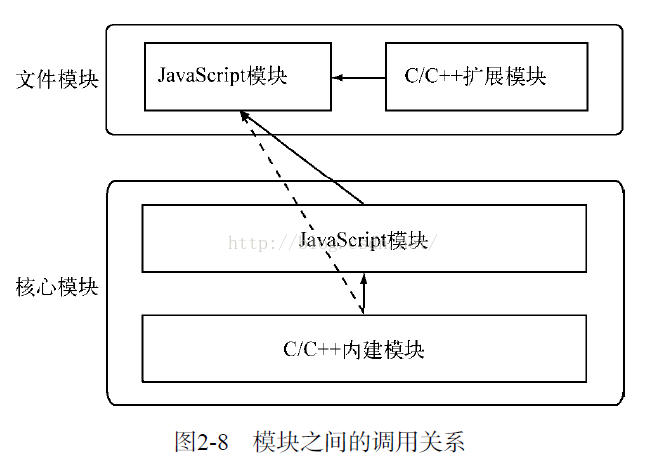

### 第二章 模块机制

    在web2.0流行的过程中，各自前段库和框架被开发出来,它们最初用于兼容各个版本的浏览器，随后随着更多的用户需求在前端被实现，
    JavaScript也从表单效验跃迁打到应用开发的级别上。在这个过程中，它大致经历了工具类库、组件库、前端框架、前端应用的变迁。

    JavaScript先天就缺乏一项功能：模块，在其他高级语言中，Java，Python有import机制，Ruby有require，PHP有include
    和require，而JavaScript通过<script>标签引入代码的方式显得杂乱无章，语言自身毫无组织和约束能力。

#### 2.1 CommonJS规范

    CommonJS规范为JavaScript制定了一个美好的愿景——希望JavaScript能够在任何地方运行。

    JavaScript自身而言，ECMAScript规范依然是薄弱的，还有以下缺陷:

    1. 没有模块系统
    2. 标准库没有，ECMAScript仅定义了部分核心库，对于文件系统，I/O流等常见需求去没有标准的API.
    3. 没有标准接口，在JavaScript中，几乎没有定义过如web服务器或者数据库之类的标准统一接口。
    4. 缺乏包管理系统。导致JavaScript应用中基本没有自动加载和安装依赖的能力。

    CommonJS规范提出，主要是为了弥补当前JavaScript没有标准的缺陷，以达到像Python，Java具备开发大型应用的基础能力。
    而不是停留在小脚本程序的阶段。他们期望那些用CommonJS API 写出的应用可以具备跨宿主环境的执行的能力，这样不仅可以
    利用JavaScript开发福客户端应用，而且可以编写以下应用：
        a）服务器端JavaScript应用程序。
        b) 命令行工具
        c）桌面图形界面应用程序。
        d）混合应用（Titanium 和 Adobe AIR 等形式的应用）

        Node能以一种比较成熟的姿态出现，离不开CommonJS规范的影响。在服务器端，CommonJS能以一种寻常的姿态写进各个公司的项目
        代码中，离不开Node优异的表现，实现的优良表现离不开规范最初优秀的设计，规范因实现的推广而得以普及。

        Node借鉴了CommonJS的Modules规范实现了一套非常易用的模块系统，NPM对Packages规范的完好支持使得Node应用在开发过程中
        事半功倍。

#### 2.1.2 CommonJS的模块规范

    CommonJS对模块的定义十分简单，主要分为模块引用、模块定义和模块标识3个部分。
    1.模块引用
    在CommonJS规范中，存在require()方法，这个方法接受模块标识，以此引入一个模块的API到当前上下文中。

    2.模块定义
    在模块中，上下文提供require（）方法来引入外部模块。对应引入的功能，上下文提供了exports对象用于导出当前模块的方法或者变量，
    并且它是唯一导出的出口。在模块中，还存在一个module对象，它代表模块自身，而exports是module属性。在Node中，一个文件就是
    一个模块，将方法挂载在exports对象上作为属性即可定义导出的方式：

    3.模块标识
    模块标识其实就是传递给require（）方法的参数，它必须是符合小驼峰命名的字符串，或者以.、..开头的相对路径，或者绝对路径。
    它可以没有文件名后缀.js.

    模块的定义的十分简单，接口也十分简洁。它的意义在于将类聚的方法和变量等限制在私有的作用域，同时支持引入和导出功能以顺畅地
    连接上下游依赖。

#### 2.2 Node的模块实现

    Node在实现中并非完全按照规范实现，而是对模块规范进行了一定的取舍，同时也增加了少许自身需要的特性。尽管规范中exports，
    require和module听起来十分简单，但是Node在实现它们的过程中究竟经历了什么，

    在Node中引入模块，需要经历3个步骤。
    1）路径分析，
    2）文件定位
    3）编译执行。

    在Node中，模块分为两类：一类是Node提供的模块，称为核心模块；另一类是用户编写的模块，称为文件模块。

    核心模块部分在Node源代码的编译过程中，编译进了二进制执行文件。在Node进程启动时，部分核心模块就被执行加载进内存中，所以这
    部分核心模块引入时，文件定位和编译执行这两个步骤可以省略掉，并且在路径分析中优先判断，所以它的加载速度是最快的。

    文件模块则是在运行时动态加载，需要完整的路径分析、文件定位、编译执行过程，速度比核心模块忙。

#### 2.2.1 优先从缓存加载

    与前端浏览器会缓存静态脚本文件以提高性能一样，Node对引入过的模块都会进行缓存，以减少二次引入时的开销。不同地方在于，浏览器
    仅仅缓存文件，而Node缓存的是编译和执行之后的对象。

    不论是核心模块还是文件模块，require（）方法对相同模块的二次加载都一律采用缓存优先的方式，这是第一优先级的。不同之处在于核心
    模块的缓存检查先于文件模块的缓存检查。

#### 2.2.2 路径分析和文件定位

    1.模块标识符分析
        前面提到过，require（）方法接受一个标识符作为参数。在Node实现中，正是基于这样一个标识符进行模块查找的。模块标识符在
        Node中主要分为以下几类：
        a）核心模块，如http、 fs、path等
        b）.或..开始的相对路径文件模块
        c）以/开始的绝对路径文件模块。
        d）非路径形式的文件模块，如自定义的connect模块。

        1）核心模块
        核心模块的优先级仅次于缓存加载，它在Node的源代码编译过程中已经编译为二进制代码，其加载过程最快。如果试图加载一个与核心
        模块标识符相同的自定义模块，那是不会成功的。如果自己编写了一个http用户模块，想要加载成功，必须选择一个不同的标识符或者
        换用路径方式。

        2）路径形式的文件模块
        以.或..开始的标识符，这里都被当做文件模块来处理。在分析路径模块时，require（）方法会将路径转为真实路径，并以真实路径
        作为索引，将编译执行后的结果存放到缓存中，以使二次加载时更快。
        由于文件模块给Node指明了确切的文件路径，所以在查找过程中可以节省大量时间，其加载速度慢与核心模块。

        3）自定义模块
        自定义模块指的是非核心模块，也不是路径形式的标识符。它是一种特殊的文件模块，可能是一个文件或包的形式。这类模块的查找
        是最费时的，也是所有方式中最慢的一种。

    2.文件定位

        从缓存加载的优化策略使得二次引入时不需要路径分析、文件定位和编译执行的过程，大大提高了再次加载模块的效率。

        1）文件扩展名分析
        require（）在分析标识符的过程中，会出现标识符中不包含文件扩展名的情况。CommonJS模块规范也允许在标识符中不包含文件扩展名，
        这种情况下，Node会按.js、.json、.node的次序补足扩展名，依次尝试。
        小诀窍：如果是.node和.json文件，在传递给require（）的标识符中带上扩展名，会加快一点速度，同步配合缓存，可以大幅度缓解
        Node单线程中阻塞式调用的缺陷。

        2）目录分析和包
        在分析标识符的过程中，require（）通过分析文件扩展名之后，可能没有查找到对应的文件，但却得到一个目录，这在引入自定义模块
        和逐个模块路径进行查找时经常会出现，此时Node会将目录当做一个包来处理。

        在这个过程中，Node对CommonJS包规范进行了一定程度的支持，首先，Node在当前目录下查找package.json(CommonJS包规范定义的
        包描述文件)，通过JSON.parse（）解析出包描述对象，从中取出main属性指定的文件名进行定位。如果文件名缺少扩展名，将会进入
        扩展名分析的步骤。而如果main属性指定的文件名错误，或者压根没有package.json文件，Node会将Index当做默认文件名，
        然后依次查找index.js、index.json、index.node.

        如果在目录分析的过程中没有定位成功任何文件，则自定义模块进入下一个模块路径进行查找。如果模块路径数组都被遍历完毕，依然没有
        找到目标文件则会抛出查找失败的异常。

#### 2.2.3 模块编译

    在Node中，每个文件模块都是一个对象。

    编译和执行时引入文件模块的最后一个阶段。定位到具体的文件后，Node会新建一个模块对象，然后根据路径载入并编译。对于不同的文件扩展名，
    其载入方法也不同
    1）.js文件，通过fs模块同步读取文件后编译执行。
    2）.node文件，这是用C/C++编写的扩展文件，通过dlopen()方法加载最后编译生成的文件。
    3）.json文件，通过fs模块同步读取文件后，用JSON.parse()解析返回结果。
    4）其余扩展名文件，它们都被当做.js 文件载入。

    每一个编译成功的模块都会将其文件路径作为索引缓存在Module._cache对象上，以提高二次引入的性能。

    1. JavaScript模块的编译。
    回到CommonJS模块规范，我们知道每个模块文件中存在着require、exports、module这3个变量，但是它们在模块文件中并没有定义，那么从
    何而来呢？我们知道每个模块中还有_filename、_dirname这两个变量的存在，它们又是从何而来的呢？
    事实上，在编译的过程中，Node对获取的JavaScript文件内容进行了头尾包装。在头部添加了（function (exports, require, module,
    _filename, _dirname){\n,在尾部添加了\n}）;

    这样每个模块文件都进行了作用域隔离。包装之后的代码会通过vm原生模块的runInThisContext()方法执行（类似eval，只是具有明确上下文，
    不污染全局），返回一个具体的function对象，最后，将当期模块对象的exports属性、require()方法、module（模块对象自身）。以及在
    文件定位中得到的完整文件路径和文件目录作为参数传递给这个function（） 执行。

    如果要达到require引入一个类的效果，请赋值给module.exports对象。这个迂回的方案不改变形参的引用。

    2. C/C++模块的编译
    Node调用process.dlopen()方法进行加载和执行。在Node的架构下，dlopen()方法在windos和*nix平台下分别有不同的实现，通过libuv
    兼容层进行了封装。实际上，.node的模块文件并不需要编译，因为它是编写C/C++模块之后编译生成的，所以这里只有加载和执行的过程。
    在执行的过程中，模块的exports对象与.node模块产生联系，然后返回给调用者。

    C/C++模块给Node使用者带来的优势主要是执行效率方面的，劣势则是C/C++模块的编写门槛比JavaScript高。

    3.JSON文件的编译
    .json文件的编译时3种编译方式中最简单的。Node利用fs模块同步读取JSON文件的内容之后，调用JSON.parse()方法得到对象，然后将它赋给
    模块对象的exports以供外部调用。JSON文件在用作项目的配置文件时比较有用。如果你定义一个JSON文件作为配置，那就不必调用fs模块
    去异步读取和解析，直接调用require()引入即可。
    此外，你还可以享受到模块缓存的便利。并且二次引入时也没有性能影响。

#### 2.3 核心模块

    Node的核心模块在编译成可执行文件的过程被编译进了二进制文件。核心模块其实分为C/C++编写的和JavaScript编写的两部分，其中
    C/C++文件存放在Node项目的src目录下，JavaScript文件存放在lib目录下。

#### 2.3.1 JavaScript核心模块的编译过程

    在编译所有C/C++之前，编译程序需要将所有的JavaScript模块文件编译C/C++代码，此时是否直接将其编译为可执行代码了呢？其实不是。

    1.转存为C/C++代码
    Node采用了V8附带的js2c.py工具，将所有内存的JavaScript代码，（src/node.js和lib/*.js）转换成C++里的数组，生成
    node_natives.h头文件。在这个过程中，JavaScript代码以字符串的形式存储在node命名空间中，是不可直接执行的。在启动Node进程时，
    JavaScript代码直接加载进内存中。在加载的过程中，JavaScript核心模块经历标识符分析后直接定位到内存中，比普通的文件模块从磁盘
    中一处一处查找要快很多。

    2.编译JavaScript的核心模块
    lib目录下的所有模块文件也没有定义require、module、exports这些变量。在引入JavaScript核心模块的过程中，也经历了头尾包装的
    过程，然后才执行和导出了exports对象。与文件模块有区别的地方在于：获取源代码的方式（核心模块是从内存中加载的）以及缓存执行
    结果的位置。

    JavaScript核心模块的定义如下面的代码所示，源文件通过process.binding('natives')取出。编译成功的模块缓存
    到NativeModule._cache对象上。文件模块则缓存到Module._cache对象上。

#### 2.3.2 C/C++核心模块的编译过程

    在核心模块中，有些模块全部由C/C++编写，有些模块则由C/C++完成核心部分，其他部分则由JavaScript实现包装或向外导出，以满足
    性能需求。后面这种C++模块主内完成核心，JavaScript主外实现封装的模式是Node能够提高性能的常见方式。通常，脚本语言的开发速
    度优于静态语言，但是其性能则弱于静态语言。而Node的这种复合模式可以在开发速度和性能之间找到平衡点。

    我们将那些由纯C/C++编写的部分统一称为内建模块，因为它们通常不被用户直接调用。Node的buffer、crypto、evals、fs、os等模块
    都是部分通过C/C++编写的。

    1. 内建模块的组织形式
    在Node中，内建模块的内部结构定义如下：
    struct node_module_struct{
    int version;
    void *dso_handle;
    const char *filename;
    void (*register_func)(v8::Handle<v8::Object> target);
    const char *modname;
    }

    Node_extensions.h文件将这些散列的内建模块统一放进了一个叫node_module_list的数组中，这些模块有：
    node_buffer、node_crypto、node_evals、node_fs、node_http_parser、node_os、node_zlib、node_timer_wrap
    node_tcp_wrap、node_udp_wrap、node_pipe_wrap、node_tty_wrap、node_process_wrap、node_fs_event_wrap
    node_signal_watcher。

    内建模块的优势在于：首先，它们本身由C/C++编写，性能上优于脚本语言；其次，在进行文件编译时，它们被编译进二进制文件。
    一旦Node开始执行，它们被直接加载进内存中，无须再次做标识符定位、文件定位、编译等过程，直接就可执行。

    2. 内建模块的导出
    在Node的所有模块类型中，存在着一种依赖层级关系，即文件模块可能会依赖核心模块，核心模块可能会依赖内建模块。
    通常，不推荐文件模块直接调用内建模块。如需调用，直接调用核心模块即可，因为核心模块中基本都封装了内建模块。
    那么内建模块是如何将内建变量或方法导出，以供外部JavaScript核心模块调用的呢？

    Node启动时，会生成一个全局变量process，并提供Binding()方法来协助加载内建模块，Binding()的实现代码在src/node.cc中
    在加载内建模块时，我们先创建一个exports空对象，然后调用get_builtin_module()方法取出内建模块对象，通过执行register_func()
    填充exports对象，最后将exports对象按模块名缓存并返回给调用方完成导出。

#### 2.3.3 核心模块的引入流程

#### 2.3.4 编写核心模块

    编写头文件，编写C++文件，更改src/node_extensions.h，更改node的项目生成文件，编译，安装

#### 2.4.1 前提条件
    如果想要编写搞质量的C/C++扩展模块，还需要深厚的C/C++编程功底才行。

    1.GYP项目生成工具
    2.V8引擎C++库
    3.libuv库，
    4.Node内部库，
    5.其他库。

#### 2.4.2 C/C++扩展模块的编写

    无须将源代码写进node命名空间，也不需要提供头文件

#### 2.4.4 C/C++扩展模块的加载
    Require()在引入.node文件的过程中，经历了四个层面的调用
    加载.node文件的两个步骤：
    ①调用uv_dlopen()方法打开动态链接库
    ②调用uv_dlsym()找到动态链接库中通过NODE_MODULE宏定义的方法地址
    两个过程都通过libuv库进行封装

 

#### 2.5 模块调用栈

    C/C++内建模块属于最底层的模块，它属于核心模块，主要提供API给JavaScript核心模块和第三方JavaScript文件模块调用。

    JavaScript核心模块主要扮演的职责有两类：一类是作为C/C++内建模块的封装层和桥梁层，供文件模块调用；一类是纯粹的
    功能模块，它不需要跟底层打交道，但是又十分重要

    文件模块通常由第三方编写，包含普通JavaScript模块和C/C++扩展模块，这样调用方向为普通JavaScript调用扩展模块。

  

